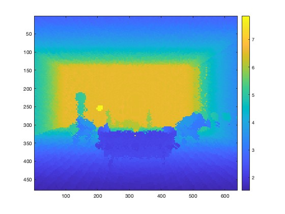

# Reconfigurable Intelligent Surface Aided Wireless Sensing for Scene Depth Estimation
This is a MATLAB code package related to the following article: "[Reconfigurable Intelligent Surface Aided Wireless Sensing for Scene Depth Estimation](https://ieeexplore.ieee.org/abstract/document/10279208)", accepted to the IEEE International Conference on Communication (ICC), 2023.

# Abstract of the Article
Current scene depth estimation approaches mainly rely on optical sensing, which carries privacy concerns and suffers from estimation ambiguity for distant, shiny, and transparent surfaces/objects. Reconfigurable intelligent surfaces (RISs) provide a path for employing a massive number of antennas using low-cost and energy-efficient architectures. This has the potential for realizing RIS-aided wireless sensing with high spatial resolution. In this paper, we propose to employ RIS-aided wireless sensing systems for scene depth estimation. We develop a comprehensive framework for building accurate depth maps using RIS-aided mmWave sensing systems. In this framework, we propose a new RIS interaction codebook capable of creating a sensing grid of reflected beams that meets the desirable characteristics of efficient scene depth map construction. Using the designed codebook, the received signals are processed to build high-resolution depth maps. Simulation results compare the proposed solution against RGB-based approaches and highlight the promise of adopting RIS-aided mmWave sensing in scene depth perception.

# Code Package Content

**Data preparation**
- The data used in this package can be found in this [Dropbox folder](https://www.dropbox.com/scl/fo/9xo7fweq7mj1b72w4lj3k/AGf2tlPVfbtO7XvJOQW__ns?rlkey=2rvewm909riuya09u5yjics9w&dl=0). Please download these files to the current repository.
- The Blender and Wireless Insite files of the samples can be found in this [Dropbox folder](https://www.dropbox.com/scl/fo/35yfhy0fil7k9rvxdb2cv/AC0hGyayUdbUbKbaevAcymg?rlkey=ynrgtgkynt50uauxp2ruot86g&dl=0).

**RIS-based depth estimation**
- Run `main.m` to generate the results.
- Run `estimate_error.m` to compute the estimation error and plot the figure.

If you have any questions regarding the code, please contact [Hao Luo](mailto:h.luo@asu.edu).

# Authors
- [Abdelrahman Taha](https://sites.google.com/view/abdelrahmantaha), Wireless Intelligence Lab, Arizona State University
- [Hao Luo](https://lacoluo.github.io), Wireless Intelligence Lab, Arizona State University

# License and Referencing
 This code package is licensed under a [Creative Commons Attribution-NonCommercial-ShareAlike 4.0 International License](https://creativecommons.org/licenses/by-nc-sa/4.0/).

If you in any way use this code for research that results in publications, please cite our original article:

> A. Taha, H. Luo and A. Alkhateeb, "Reconfigurable Intelligent Surface Aided Wireless Sensing for Scene Depth Estimation," ICC 2023 - IEEE International Conference on Communications, Rome, Italy, 2023, pp. 491-497.
